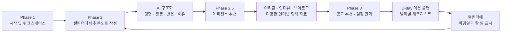

# 취뽀 log

> 취업 준비 과정의 작은 경험을 기록하고, 그 기록을 다음 행동으로 연결하는 AI 취준 매니저

**Codex Community Korea Hackathon Team03** 프로젝트입니다. Codex CLI를 중심으로 ChatGPT와 OpenAI API를 기획, 구현, 문서화, 배포 전 과정에 적극 활용했습니다.

## 📌 Overview

무엇을 해야 할지 아직 모르거나 취업 준비의 기반이 없는 사람은 단편적인 검사 결과만으로 자신의 방향을 결정하기 어렵습니다.

취뽀log는 정량적인 점수로 사용자를 단정하기보다, 취업을 준비하며 쌓인 개인의 경험과 반응을 장기간 기록하는 방식에서 출발합니다. 사용자가 작성한 취준노트를 AI가 구조화하고, 축적된 개인 서사를 바탕으로 개인화된 분석과 다음 행동을 제공합니다.

AI가 정답을 대신 결정하는 것이 아니라, 사용자가 자신의 경험과 판단 기준을 돌아보며 메타인지를 높이고 스스로 더 나은 결정을 내릴 수 있도록 근거와 탐색 자료를 제공하는 것이 취뽀log의 목표입니다.

서비스의 중심 화면은 **캘린더 기반 워크스페이스**입니다. 사용자는 캘린더에서 날짜를 선택해 노션처럼 이어지는 공간에 오늘의 취준노트를 작성하고, 추천받은 공고의 마감일과 D-day까지 수행할 체크리스트를 같은 캘린더에서 관리합니다.

## 🗺️ 서비스 흐름



### Part 1 — 탐색

사용자는 취업 준비 중 수행하거나 접한 일을 **취준노트**로 기록합니다. AI는 기록을 사실 기반으로 구조화하고, 사용자가 관심을 더 깊게 탐색할 수 있도록 아티클, 현직자 인터뷰, 브이로그 등 다양한 레퍼런스를 제안합니다.

### Part 2 — 공고 · 일정 관리 · 액션 플랜

축적된 취준노트를 바탕으로 공고를 추천합니다. 사용자가 공고 등록을 선택하면 채용 마감일을 캘린더에 표시하고, 예를 들어 D-14부터 마감일까지 매일 수행할 수 있는 액션 플랜과 체크리스트를 함께 배치합니다.

## 💡 핵심 아이디어

- 사소한 취업 준비 경험도 개인의 방향을 이해하는 중요한 근거가 될 수 있습니다.
- 일회성 직업심리검사보다 장기간 축적된 개인 서사를 활용합니다.
- 사용자의 기록을 누적해 개인화된 분석과 피드백을 제공합니다.
- 자신의 경험과 반응을 다시 살펴보며 취업 준비 과정의 메타인지를 높입니다.
- AI는 성향이나 적합 직무를 성급하게 단정하지 않고 기록을 사실 기반으로 구조화합니다.
- 레퍼런스와 실행 가능한 액션을 제공해 탐색이 실제 취업 준비로 이어지게 합니다.

## 🤖 AI 활용

OpenAI API를 사용해 취준노트에서 다음 정보를 구조화합니다.

```text
experience / activities / reaction / reason
```

AI가 필요하지 않은 일정 및 체크리스트 생성은 규칙 기반으로 분리해 API 비용을 줄였습니다.

## 🛠️ 기술 스택 및 도구

- Backend: Java 17, Spring Boot, Spring Security, Spring Data JPA
- Database: PostgreSQL
- Frontend: HTML, CSS, JavaScript
- AI: OpenAI Responses API
- Deployment: AWS EC2, Docker, Docker Compose
- Build: Gradle
- AI Collaboration: Codex CLI, ChatGPT, OpenAI API
- Version Control: Git, GitHub

## 🚀 배포

**서비스 링크:** [http://43.201.115.195:8080/](http://43.201.115.195:8080/)

배포 환경은 AWS EC2 위에서 Docker Compose를 사용해 Spring Boot 애플리케이션과 PostgreSQL을 함께 실행합니다.

## 🎬 발표 및 데모

- [발표자료 PDF](./presentation.pdf)
- [데모 영상 MP4](./demo-video.mp4)

## 👥 팀원 및 Codex 협업

### 🔍 이예림 — Insight / Product Logic / PRD

선행연구와 경쟁 서비스 조사, 아이디어 수렴, 취준노트 구조 설계, `experience / activities / reaction / reason` 필드 정의, Information Gap 기반 레퍼런스 검색 및 평가 로직과 PRD 구체화를 담당했습니다.

### 🎨 정세빈 — Frontend / Interaction Prototype

취준노트와 레퍼런스 초기 프로토타입부터 캘린더 기반 워크스페이스까지 구현했습니다. Codex와 함께 HTML/CSS/JavaScript를 생성하고 실제 상호작용을 확인하며 모달, 상태 갱신, 공고별 액션 플랜을 반복 개선했습니다.

### ⚙️ 정수진 — Backend / DB / AI / Deployment

Spring Boot, PostgreSQL, 인증, 취준노트, OpenAI API 구조화, 채용 공고와 액션 플랜, 캘린더 연동을 구현하고 Docker Compose와 EC2 배포를 연결했습니다.

### 📝 이석민 — Presentation / Documentation

PRD와 구현 결과를 Markdown으로 구조화하고 Codex를 활용해 발표자료와 문서를 제작했습니다. 렌더링 결과를 검수하며 정보 밀도와 발표 흐름을 반복 개선했습니다.

---

Made for **Codex Community Korea Hackathon** by **Team03**.
